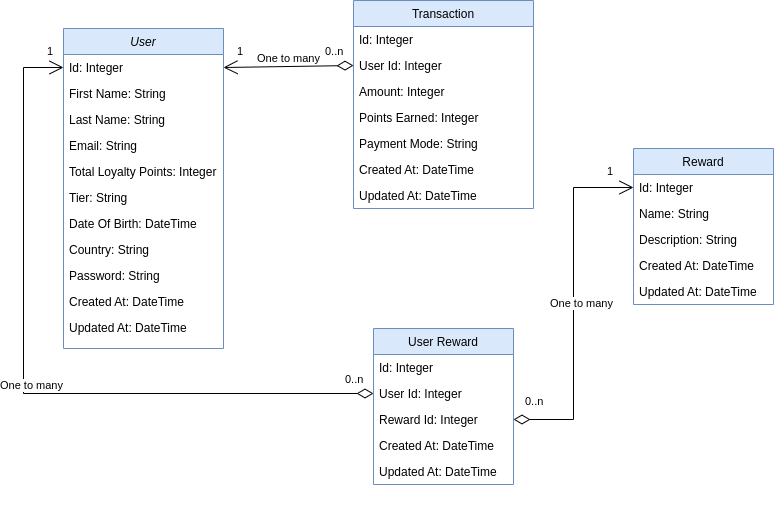

# README
## About
This platform offers clients the ability to issue loyalty points to their end users. End users use their points to claim/purchase rewards offered by the client. These loyalty points and loyalty tier calculated based on transactions made by users.

Reference: https://github.com/PerxTech/whistler-interview

## Development Setup
1. Install Postgresql and create `perxtech` role with password
2. Git clone this repository
	 - git clone https://github.com/praveen-arul/Perxtech.git
3. `bundle install`
4. `rails db:create` 
5. `rails db:migrate`

## Running Seeds
1. `rails db:seed`
2. `rails db:setup` will create the database, load the schema, and initialize it with the seed data.
3. `rails db:reset` will drop the database and set it up again.

## Running Dev Server
`rails server`

## Running Tests
`rspec` to run the test all the scripts to reduce the issues

## Services
- Used Whenever gem for running scheduled rake tasks
  Reference: https://github.com/javan/whenever
- Sidekiq `bundle exec sidekiq` for running scheduled jobs
	Can check the scheduled job here: http://localhost:3000/sidekiq

## Git flow
A standard flow would go like this:

1. Create a separate working branch (ideally indicate the intent in the name such as fix/feature/refactor/hotfix)
1. After developing merge the working branch to the develop branch which will trigger deployment to staging environment
1. Test on staging and get the requester sign-off
1. Once the code is production-ready create a new PR from the same working branch but set the base branch as main.
1. In case of any conflicts resolve them by merging main into the working branch and of course resolving the remaining conflicts if any
1. Request review

# RELEASE NOTES
I have successfully completed the task which is provided by Perxtech. Below is the complete list of features, kindly check the details

Reference: https://github.com/PerxTech/whistler-interview

## Reward Rules
- ## Airport Lounge Reward
  - Give 4x Airport Lounge Access Reward when a user becomes a gold tier customer
- ## Free Coffee Reward
	- A Free Coffee reward is given to all users during their birthday month
	- If the end user accumulates 100 points in one calendar month they are given a Free Coffee reward
- ## Free Movie Reward
	- A Free Movie Tickets reward is given to new users when their spending is > $1000 within 60 days of their first transaction
- ## 5% Cash Rebate Reward
	- A 5% Cash Rebate reward is given to all users who have 10 or more transactions that have an amount > $100
- ## Bonus Points
	- Every calendar quarterly give 100 bonus points for any user spending greater than $2000 in that quarter

## Point Earning Rules
- For every $100 the end user spends they receive 10 points
- If the end user spends any amount of money in a foreign country they receive 2x the standard points
- Points expire every year

## Loyalty Rules 
- A standard tier customer is an end user who accumulates 0 loyalty points
- A gold tier customer is an end user who accumulates 1000 loyalty points
- A platinum tier customer is an end user who accumulates 5000 loyalty points

# Additional Features
## Reward Expiration
- Rewards will be expired automatically after 1 year, created a cron job to expire the user rewards
  - `rake 'expiring_rewards:after_1year'` added this rake task in schedule.rb which will check the rewards on daily basis and expire it after 1 year
## Security
- Cross-Site Request Forgery - CSRF token
## Validation
- Added basic validation to verify data.
## Improved UI
- Used Bootstrap and designed the UI
## Gems Used
- devise - Used for Authentication
	- Reference: https://github.com/heartcombo/devise
- rspec-rails - Used for writing test cases
	- Reference: https://github.com/rspec/rspec-rails
- sidekiq - Used for scheduling background jobs
- activerecord-import - Used for bulk import of records
## Sample Images
- Reference: https://drive.google.com/drive/folders/1yeBcpphseWSQ5Gt5WERuYn0i5QLoyCF6?usp=sharing
## Class Diagram

